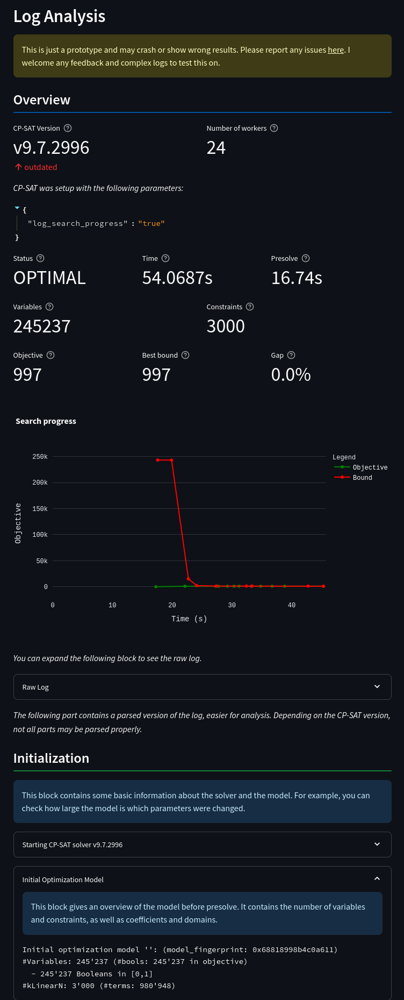

# CP-SAT-Log-Analyzer

Dive into the world of constraint programming with ease using our CP-SAT Log Analyzer. This tool transforms the dense and detailed logs of CP-SAT into clear, readable formats, complemented by intuitive visualizations of key metrics. Whether you're tuning your model or exploring data, our analyzer simplifies and enlightens your journey with CP-SAT. Let us make complex logs simple and actionable!

