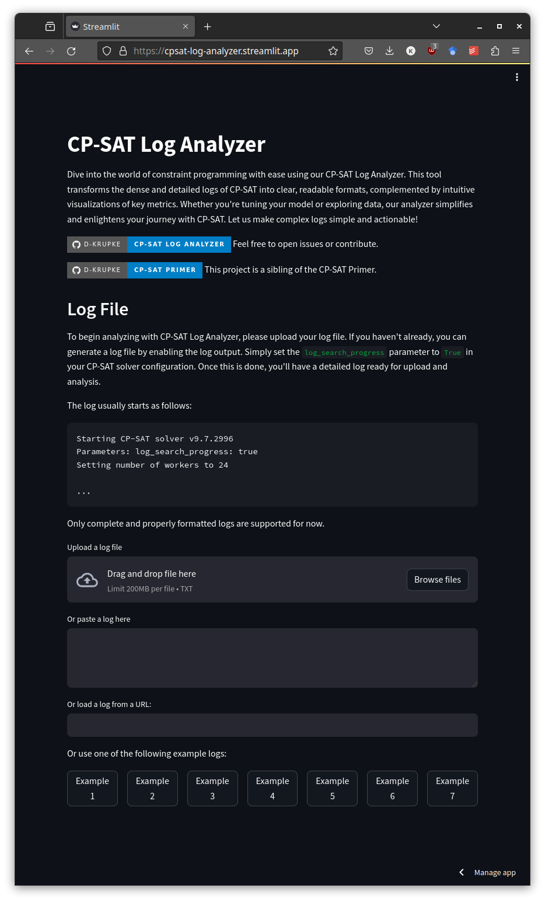
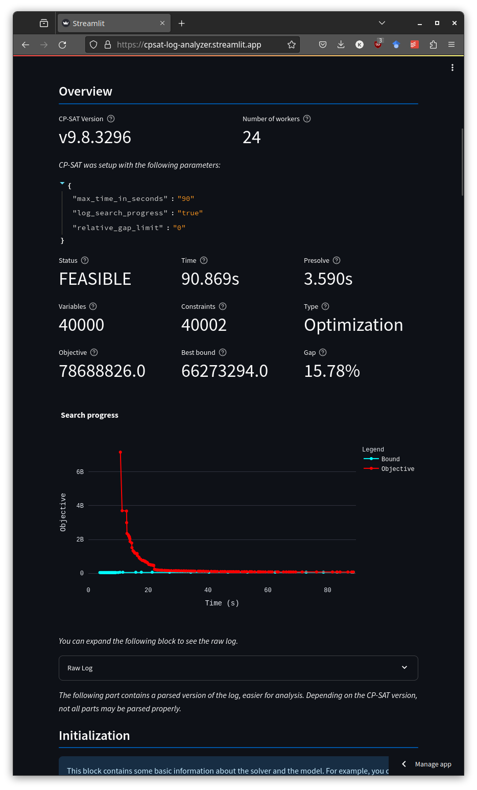
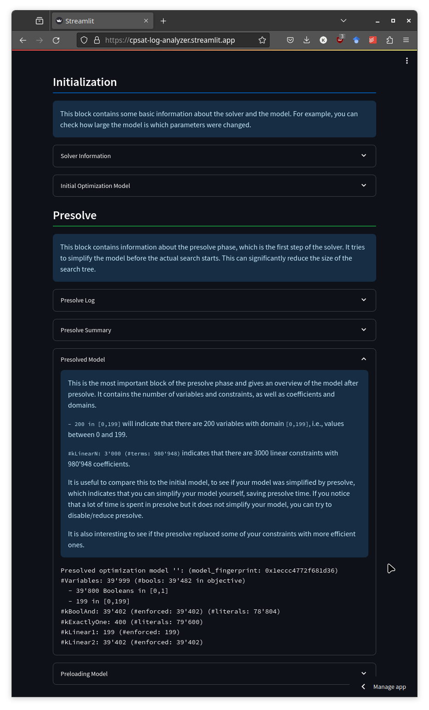
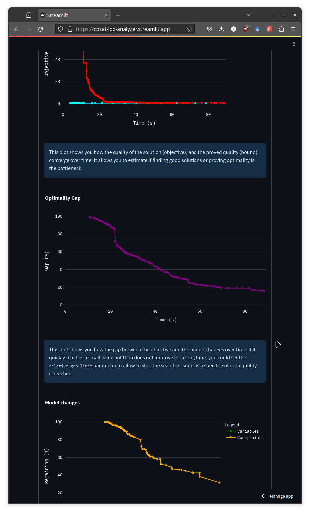
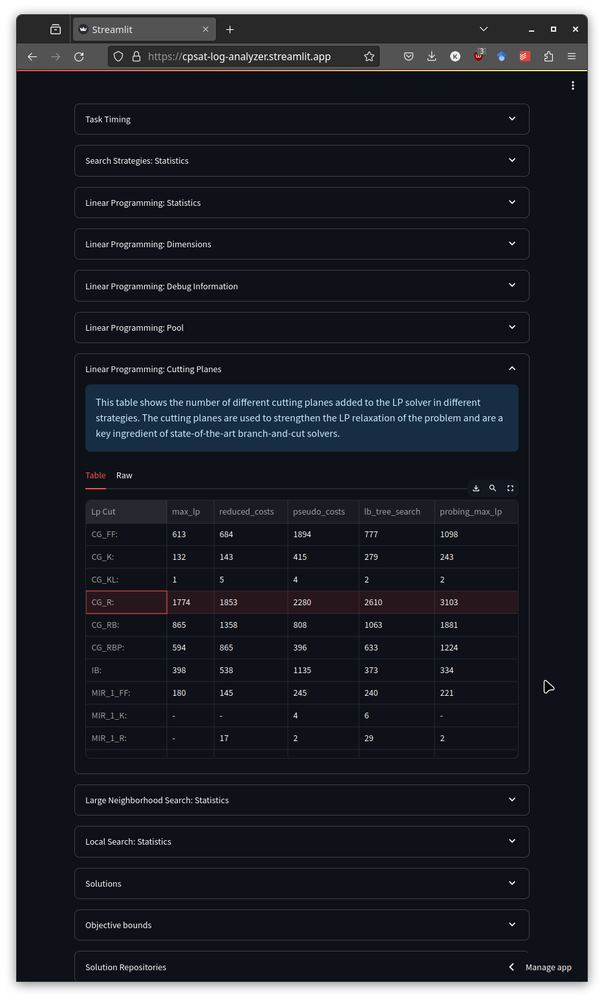

# CP-SAT-Log-Analyzer

Dive into the world of constraint programming with ease using our CP-SAT Log
Analyzer. This tool transforms the dense and detailed logs of CP-SAT into clear,
readable formats, complemented by intuitive visualizations of key metrics.
Whether you're tuning your model or exploring data, our analyzer simplifies and
enlightens your journey with CP-SAT. Let us make complex logs simple and
actionable!

[](https://cpsat-log-analyzer.streamlit.app/)

_This project is not affiliated with Google._

## Easy Upload

Various ways to quickly upload your log files, and multiple examples to get you
started. If you have you log file uploaded somewhere, you can also create a link
to it that you can share with others. There are some simple security measures in
place to prevent abuse. Please let me know if they are too restrictive.



## Overview

The overview page gives you a quick overview of the most important metrics of
your log file.



## Documentation

The logs are not only parsed and displayed, but also explained. Hovering over
the question mark next to a metric will give you a short explanation of what it
means. The individual parts of the log are annotated with a basic explanation.



## Plotting

Some important time series are plotted to give you a better understanding of
what is going on in your log file. It is interactive, and you can zoom in and
out. The hover-text gives you context on what you are looking at.



## Tabular Data

The log contains a lot of tabular data. We parse them into nice interactive
tables.



## Contributing

We welcome contributions to this project. If you have any suggestions or
encounter any bugs, please open an issue. If you want to contribute code, please
open a pull request. We will review it as soon as possible.

## Development

You can run this project locally by cloning it and running the following
commands:

```bash
pip install -r requirements.txt
streamlit run app.py
```

### Project Structure

This project has a relatively simple structure, consisting of two main parts:

1. The streamlit app with entry point `app.py` and implementation in `./_app`.
2. The parser and log documentation in `cpsat_log_parser`.

If you want to improve the parsing or documentation of a block of the log, you
can do so by just editing the corresponding file in `cpsat_log_parser/blocks`.
Every block has its own file with a name corresponding to the block name.

If you want to add a new block, you can do so by creating a new file in
`cpsat_log_parser/blocks`. The file should contain a class with the same name as
the block. This class should inherit from `LogBlock` and implement a static
`matches`-method that returns `True` if the passed part of the log matches the
block. The `get_title` and `get_help` methods should return a title and help
text for the block. For tables, there already is a `TableBlock` which is able to
return the table as a pandas DataFrame and the front-end will know to display it
as a table. If your block is more complex and wants to display plots or other
things, you will have to add a special section to the front-end. For the block
to be found, you will also have to add it to the `ALL_BLOCKS` in
`cpsat_log_parser/blocks/__init__.py`. The parser will then automatically try to
use it. Note that the order of the list is important, as the first block that
matches will be used. The `LogBlock` should always be the last as it matches
everything.

### Roadmap

Here are some ideas for future improvements:

- [ ] Implement the ability to upload multiple log files and compare them.
- [ ] Extend the documentation of the blocks. Currently, I only wrote some
      documentation for the most important blocks, sometimes by just copying
      from the CP-SAT Primer and letting ChatGPT quickly make it more readable.
- [ ] A more extensive list of examples. I have some nice examples, where you
      can actually see issues in different parts of the log, highlighting their
      importance.

### Authors

This project is developed by [Dominik Krupke](https://github.com/d-krupke/),
Postdoctoral Researcher at the Algorithms Group of the Technische Universität
Braunschweig. There is no funding for this project, and it is mainly developed
in my free time. If you want to support this project, please consider
contributing or contacting me for other ways to support it.

## Related Projects

1. [OR-Tools](https://github.com/google/or-tools/): Google's Operations Research
   Tools containing the CP-SAT solver, for which this project was created.
2. [CP-SAT Primer](https://github.com/d-krupke/cpsat-primer): A primer on
   constraint programming with CP-SAT. This project was created to complement
   this primer.
3. [gurobi-logtools](https://github.com/Gurobi/gurobi-logtools): Gurobi's log
   analyzer which is the inspiration for this project. However, this project is
   still very different from Gurobi's log analyzer.

## Changes

- 2024-10-31: Fixed parsing when the model was solved in presolve.
- 2024-09-05: Improved the parsing of the parameters.
- 2024-09-05: No longer warn if status is `OPTIMAL`, but there is a gap, as
  CP-SAT considers everything as optimal if you specified a tolerance. This is
  different to other solvers. Don't want to confuse users.
