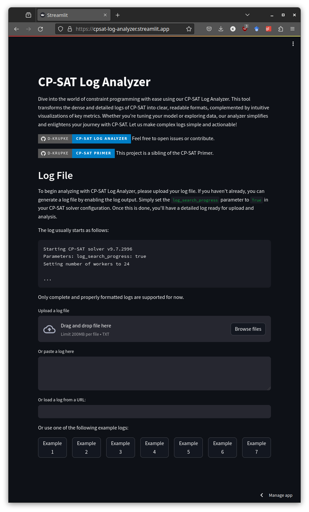
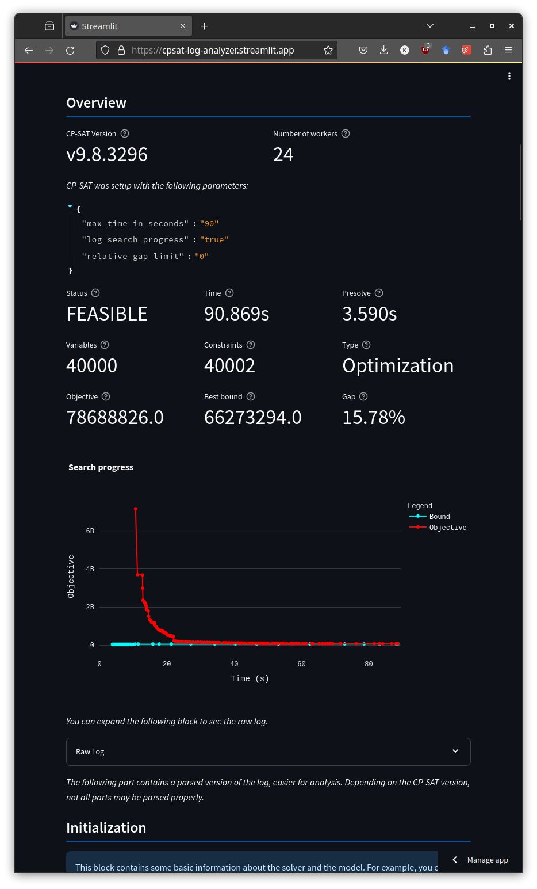
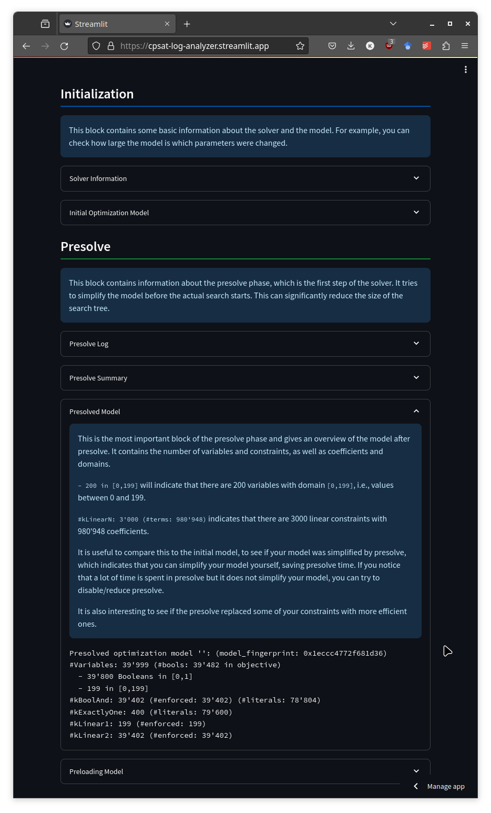
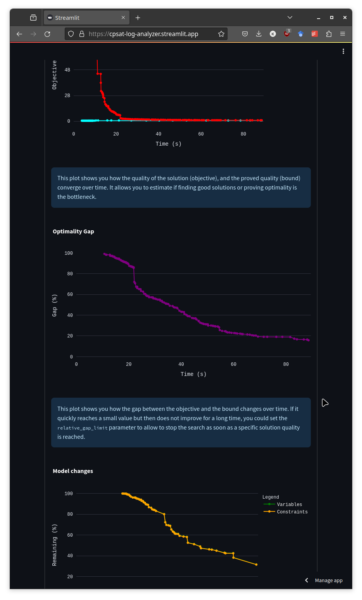
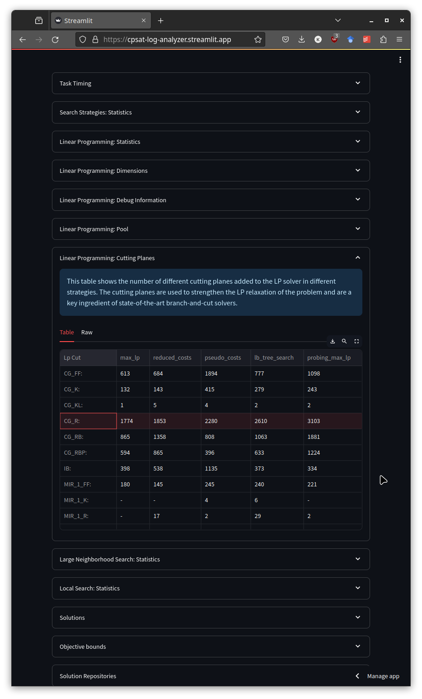

# The legacy Streamlit app

`app.py`, `_app/` and `cpsat_log_parser/` in the repository root are the original
implementation of the analyzer, and still the version behind
<https://cpsat-log-analyzer.streamlit.app/>. It is feature-frozen: new work happens in `v2/`
(see [architecture.md](architecture.md)). This page keeps the notes that used to live in the
top-level README.

## Running it

```sh
pip install -r requirements.txt
streamlit run app.py
```

It also has one feature v2 does not: a log can be loaded from a URL, so a link to a log stored
elsewhere can be shared with someone else.

## Structure

Two parts:

1. the Streamlit app - entry point `app.py`, implementation in `_app/`;
2. the parser and its log documentation in `cpsat_log_parser/`.

To improve the parsing or the documentation of one log section, edit the corresponding file in
`cpsat_log_parser/blocks/` - each block has its own file named after the block.

To add a block, create a file in `cpsat_log_parser/blocks/`, containing a class that inherits
from `LogBlock` and implements a static `matches` method returning `True` for the part of the
log it handles, plus `get_title` and `get_help`. For tabular sections there is a `TableBlock`
that returns a pandas DataFrame, which the frontend renders as a table; anything more complex
needs its own section in the frontend. Register the class in `ALL_BLOCKS` in
`cpsat_log_parser/blocks/__init__.py` - order matters, the first matching block wins, and
`LogBlock` must stay last because it matches everything.

## Screenshots

The images below show this app's UI.

| | |
| --- | --- |
|  |  |
|  |  |



## Ideas that were never implemented here

* uploading several logs and comparing them;
* a more extensive set of examples showing issues in different parts of the log (done in v2:
  see `example_logs/` and `v2/knowledge/examples.toml`);
* extending the block documentation (done in v2: `v2/knowledge/`).
